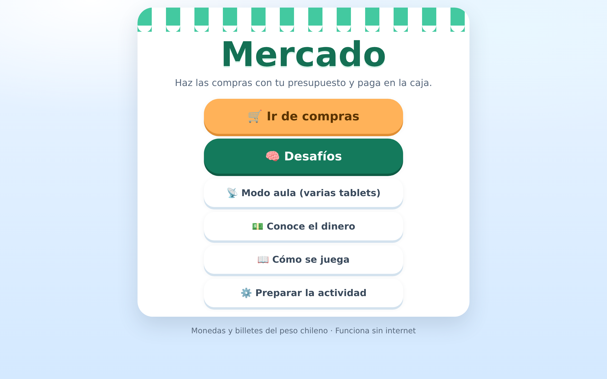

# Mercado · Manejo de dinero chileno

Juego educativo de matemática para **4° básico**: hacer las compras con un
presupuesto y pagar en la caja con billetes y monedas del peso chileno.

Hecho para la **Escuela Rural Osvaldo Hiriart Corvalán** (Botalcura, Región del
Maule). Cubre el **OA 7** y la Experiencia 3 de la planificación del curso.



---

## Para el profesor

**Instala la aplicación** desde la
[última versión publicada](https://github.com/psclaudiosotogonzalez-boop/Mercado/releases/latest)
(`Mercado Setup ...exe`) y ábrela como cualquier programa. Se actualiza sola
cuando el computador tiene internet.

O bien **abre `Mercado (archivo unico).html` con doble clic**: ese archivo lleva
dentro los estilos, el código y las imágenes del dinero, así que funciona desde
un pendrive, en cualquier computador y **sin internet**.

Todo lo demás está en **[LEEME.md](LEEME.md)**, y el modo aula paso a paso en
**[aula/LEEME - modo aula.md](aula/LEEME%20-%20modo%20aula.md)**.

## Qué trae

- **Ir de compras** — cuatro niveles: precio fijo, por unidad, por kilo con
  balanza, y todo junto. Con pago exacto o con vuelto.
- **Desafíos** — problemas no rutinarios con los precios de la feria de
  Botalcura. Sin cronómetro y sin ranking: el error se corrige con pistas, y
  tras dos intentos el estudiante puede dejar su respuesta anotada y seguir.
- **Modo aula** — varias tablets en la misma clase, dentro de la red del
  colegio. El profesor dirige, ve quién va respondiendo y quién necesita apoyo,
  y genera un informe imprimible.
- **Feria en parejas** — uno vende y cobra, el otro compra y revisa el vuelto.
  Cuando los dos números no calzan, hay que conversarlo.
- **Preparar la actividad** — los apoyos se retiran de a poco: subtotales,
  calculadora, «Te queda», tachado de la lista, exigir el cálculo del total.

## Para quien retome el desarrollo

Empieza por **[CLAUDE.md](CLAUDE.md)**: ahí están las restricciones que no se
pueden romper y las decisiones pedagógicas que se tomaron con el profesor.
Después, [LEEME-DESARROLLO.md](LEEME-DESARROLLO.md).

```bash
python3 construir.py   # reconstruye «Mercado (archivo unico).html»
npm install && npm start   # la app de escritorio
npm run app            # el instalador
```

El juego en sí es **HTML, CSS y JavaScript sin librerías ni build**. Electron es
solo la cáscara de escritorio; el archivo único tiene que seguir abriéndose con
doble clic, sin nada instalado.

---

Las imágenes del dinero provienen del *Cuadernillo de manejo de dinero*
(teocognitiva, Terapia Ocupacional), que usa el curso: los estudiantes tienen
que reconocer el dinero real.

`Cuadernillo de dinero chileno.pdf` es la versión imprimible que se armó en este
proyecto. Ningún código lo usa: está aquí como material de consulta y porque
lleva los billetes y las monedas al **doble de la resolución** que usa el juego
(654 × 306 los billetes, contra 327 × 153), que es de donde hay que sacarlos si
se rehace el material gráfico.
